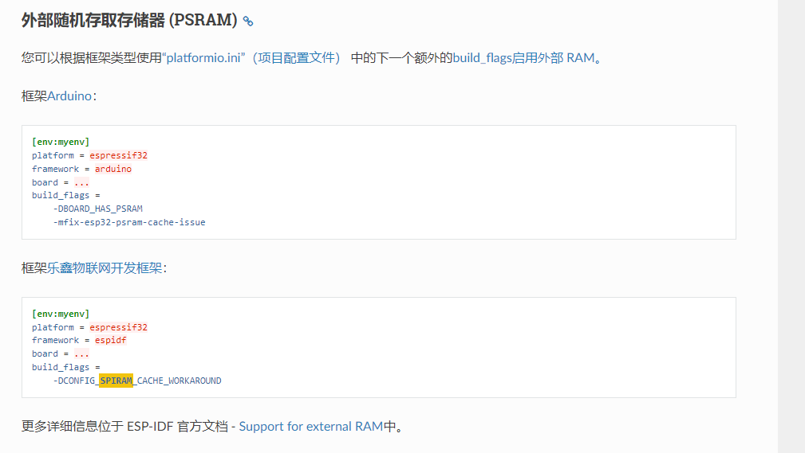
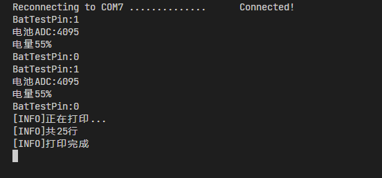

# 此工程时使用esp32实现的喵喵机
来源于立创开源广场的樱猫不知味，原工程为arduino平台代码，移植到pio平台，最初工程来源于<https://github.com/lxydiy/ESP32-Paperang-Emulator>
## esp32 wrover在PIO中使用ram

## platform.ini文件参考示例<https://docs.platformio.org/en/latest/platforms/espressif32.html>
## 正常打印的串口输出

